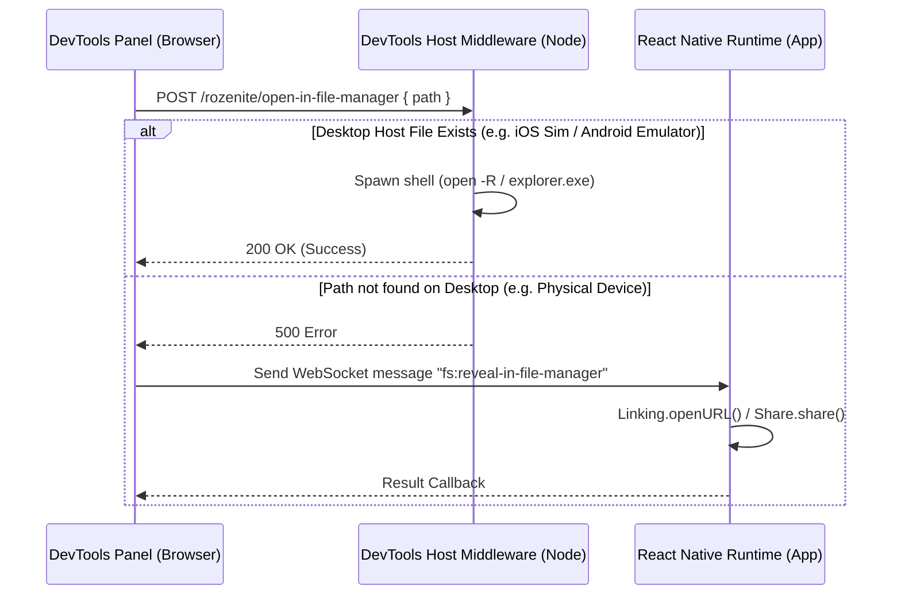

# Open in File Manager - Developer Documentation

This document describes the design, architecture, and behavior of the **"Open in File Manager"** feature in the Rozenite DevTools File System Plugin.

---

## 1. Feature Overview

The **"Open in File Manager"** feature allows developers debugging React Native/Expo apps to instantly reveal any selected file or directory inside their computer's native file manager (e.g., **Finder** on macOS, **File Explorer** on Windows, or **Files** on Linux) directly from the DevTools details panel.

---

## 2. Architecture & Flow

The feature spans across the DevTools Web frontend, the host server middleware, and the simulator/device fallback bridge.

### Flow Steps:
1. **User Action**: The developer clicks the "Open in File Manager" button in the Detail Panel (when a file or directory is selected).
2. **Desktop Request**: The browser panel sends an HTTP POST request to the local DevTools server endpoint `/rozenite/open-in-file-manager` containing the path of the selected item.
3. **Execution**:
   - **Darwin (macOS)**: Runs `open -R "<path>"` to open the parent directory and highlight the file/directory in Finder.
   - **Win32 (Windows)**: Runs `explorer.exe /select,"${safePath}"` to reveal the item in File Explorer.
   - **Linux / Other**: Falls back to `xdg-open "<path>"`.
4. **Fallback**: If the endpoint fails or throws (e.g. because the path is on a physical device sandboxed file system and doesn't exist on the desktop), the panel falls back to the React Native app's native `Linking`/`Share` API handler to open it on the device/simulator context.

---

## 3. Directory Navigation & Selection Integration

### Selection Behavior:
- **Clicking a Directory**: Automatically sets the directory as `selected` AND navigates into it (`nav.setCurrentPath`).
- **Persistence**: The active directory selection persists during navigation to keep the "Open in File Manager" button visible for that folder. Navigating up/back or selecting a different file clears the previous directory selection.

---

## 4. Modified Files Reference

- **[middleware.ts](file:///Users/ggipl/Downloads/rozenite-main/packages/middleware/src/middleware.ts)**: Registers the POST `/open-in-file-manager` endpoint and executes host-specific shell commands to reveal the path.
- **[file-system.tsx](file:///Users/ggipl/Downloads/rozenite-main/packages/file-system-plugin/src/file-system.tsx)**: Handles the click-to-select-and-navigate logic and handles fetch requests to the host with a graceful device fallback.
- **[DetailPanel.tsx](file:///Users/ggipl/Downloads/rozenite-main/packages/file-system-plugin/src/ui/DetailPanel.tsx)**: Displays the "Open in File Manager" button inside the details block next to the "Export" button.
- **[FileEntryRow.tsx](file:///Users/ggipl/Downloads/rozenite-main/packages/file-system-plugin/src/ui/FileEntryRow.tsx)**: Reverted double-click hooks to return file entries to standard single-click items.
- **[useFileSystemDevTools.ts](file:///Users/ggipl/Downloads/rozenite-main/packages/file-system-plugin/src/react-native/useFileSystemDevTools.ts)**: Handles the device-side WebSocket message fallback action.
- **[protocol.ts](file:///Users/ggipl/Downloads/rozenite-main/packages/file-system-plugin/src/shared/protocol.ts)**: Declares the WebSocket communication events.
